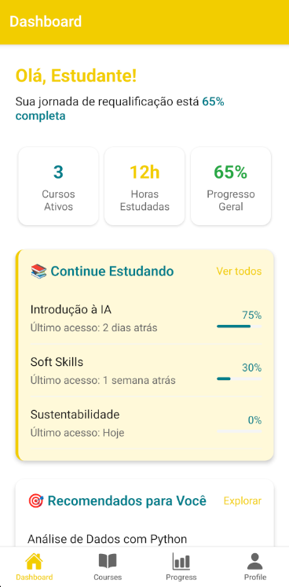
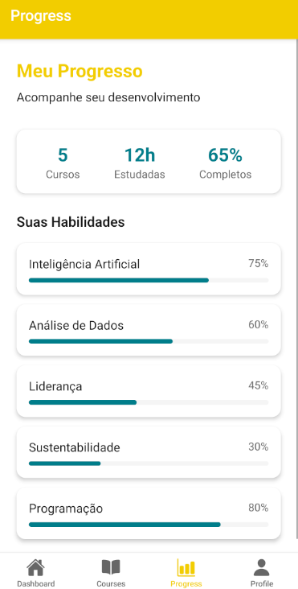
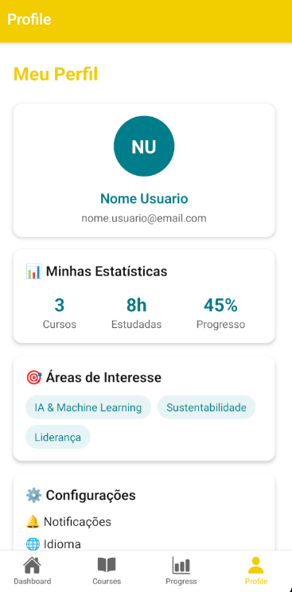
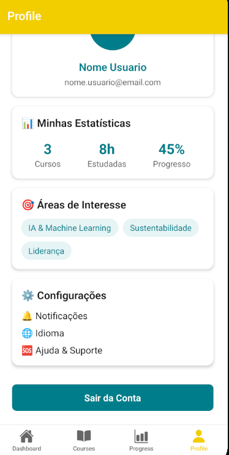

# 📱 SkillUpPlus 2030+ - React Native App

## 📋 Descrição do Projeto
O **SkillUpPlus 2030+** é um aplicativo móvel desenvolvido em **React Native com TypeScript**, focado na requalificação digital e preparação para o futuro do trabalho.  
O app conecta usuários a trilhas de aprendizado personalizadas em áreas emergentes como IA, sustentabilidade e soft skills.

### 🎯 Objetivo  
Oferecer uma plataforma móvel para:

- Realizar autoavaliação de competências  
- Acompanhar trilhas de aprendizado em áreas emergentes  
- Monitorar progresso pessoal e gerar recomendações  
- Facilitar a inclusão digital por meio de micro cursos gamificados  

---

## 👥 Integrantes do Projeto

- **Caio Hideki** — RM553630  
- **Jorge Booz** — RM552700  
- **Mateus Tibão** — RM553267
---

## 🎨 Design System
### 🎨 Paleta de Cores
- 🟡 **Amarelo Principal:** `#F2CD00` (textos destacados, headers)  
- 🔵 **Azul Aqua:** `#007D8A` (botões, elementos interativos)  
- ⚫ **Cinza Escuro:** `#191919` (textos principais)  
- ⚪ **Branco:** `#FFFFFF` (fundos, cards)  

### 📐 Estratégia 70/30/10
- **70% Branco:** fundos e áreas amplas  
- **20% Amarelo:** destaques e elementos chamativos  
- **10% Azul:** botões e CTAs  

---

## 🗂️ Estrutura do Projeto
```
SkillUpPlus2030/
├── app/
│   └── screens/
│       ├── login.tsx
│       ├── register.tsx
│       ├── dashboard.tsx
│       ├── courses.tsx
│       ├── progress.tsx
│       └── profile.tsx
├── components/
│   ├── ui/
│   │   ├── Button.tsx
│   │   └── Card.tsx
│   └── forms/
│       └── Input.tsx
├── constants/
│   ├── Colors.ts
│   └── Styles.ts
├── assets/
└── App.tsx
```

---

## 🧭 Sistema de Navegação Híbrida

### 📌 Stack Navigation
- Fluxo de Autenticação: Login → Register → Main  
- Telas hierárquicas e formulários  

### 📌 Tab Navigation
- **Dashboard:** visão geral  
- **Cursos:** trilhas e categorias  
- **Progresso:** métricas  
- **Perfil:** dados pessoais  

---

## 🛠️ Tecnologias Utilizadas
- React Native + TypeScript  
- React Navigation (Stack + Tabs)  
- Expo  
- Hooks e componentes funcionais  
- Validação de formulários em tempo real  

---

## 🎯 Funcionalidades Implementadas

### ✅ Sistema de Autenticação
- Login com validação  
- Cadastro de usuários  
- Perfil automático baseado no email  

### ✅ Dashboard Interativo
- Estatísticas  
- Recomendações  
- Metas gamificadas  

### ✅ Gestão de Cursos
- Lista de trilhas  
- Barras de progresso  
- Categorias  

### ✅ Perfil Personalizado
- Avatar com iniciais  
- Estatísticas  
- Áreas de interesse  
- Configurações  

---

## 📸 Screenshots da Aplicação
### Tela de Login  


### Tela de Cadastro  


### Dashboard Principal  



### Lista de Cursos  


### Tela de Progresso  


### Perfil do Usuário  



---

## 🔧 Como Executar o Projeto

```bash
# Clone o repositório
git clone https://github.com/jorgebooz/SkillUpPlus2030

# Instale as dependências
npm install

# Execute o projeto
npx expo start
```

---

## 📱 Requisitos do Sistema
- Node.js 16+  
- Android Studio (para emulador)  
- Expo Go (dispositivo físico)  

---

## 🎓 Conexão com os ODS da ONU
- 🎯 **ODS 4 – Educação de Qualidade:** democratiza acesso à capacitação  
- 💼 **ODS 8 – Trabalho Decente:** fomenta empregabilidade  
- 🚀 **ODS 9 – Inovação:** incentiva soluções acessíveis  
- ⚖️ **ODS 10 – Redução de Desigualdades:** inclui públicos vulneráveis  

---

## 👥 Desenvolvimento
**Desenvolvido por:** [SEU NOME AQUI]  
**Tecnologias:** React Native, TypeScript, Expo, React Navigation  
**Status:** ✔ Versão principal implementada  

---

## 📄 Licença
Projeto desenvolvido para fins educacionais como parte de **[NOME DA DISCIPLINA/INSTITUIÇÃO]**.
